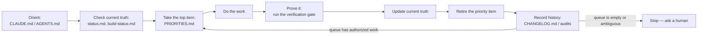

# loop-engine

**An init scaffold that lets an AI coding agent work on a project loop after
loop without the human rubber-stamping every step.**

Direction, current state, and priority get written down once, in specific
files with specific shapes. From then on, the agent reads those files
instead of asking "should I do X?" — because the answer was already decided
and recorded. The human's attention is spent on the decisions that are
actually theirs to make, not on approving things that were already implied
by an earlier decision.

This repo is the scaffold itself: a set of templates you copy into a project
and fill in, plus the concept guide explaining why the templates are shaped
the way they are.

- **New here?** Read [`LOOP_ENGINEERING.md`](LOOP_ENGINEERING.md) — the full
  concept, in depth. This README is the practical "what do I do" companion
  to it, not a replacement for it.
- **Want to see it filled in?** [`examples/linkcheck/`](examples/linkcheck/)
  is a complete worked example — every template, filled in for real, for a
  small hypothetical CLI tool.
- **Ready to adopt it?** Jump to [Quick start](#quick-start).

---

## The problem

The default way of working with an AI coding agent looks like this: the
agent proposes something, the human says "yes" or "ok," the agent does it,
repeat. Most of those "yes/ok" exchanges carry no information — the human is
rubber-stamping because re-explaining full context every time costs more
than just approving. As a project grows this gets worse: more surface area,
more decisions, more chances the agent drifts from what was actually
intended, more human attention spent just keeping the agent pointed the
right way. A fresh agent session (or a different agent tool entirely)
starts from zero and has to be re-briefed from scratch.

## The idea

Split what a project "knows" into four kinds of truth, each with exactly one
canonical home, each updated at its own natural cadence:

| Kind of truth | Question it answers | Lives in | Changes |
| --- | --- | --- | --- |
| **Direction** | Where is this going, what must never break? | `docs/project-charter.md`, `docs/domain-model.md`, `docs/system-direction.md` | Rarely — only when a human decides the goal changes |
| **Current state** | What actually exists and works right now? | `docs/status.md`, `docs/build-status.md` | Every loop that changes behavior |
| **Priority** | What is the agent authorized to work on next? | `PRIORITIES.md` | Every loop — items removed when done, reordered when danger changes |
| **History** | What happened, when, with what evidence? | `CHANGELOG.md`, `docs/audits/`, git | Append-only |

An agent working in the project reads a bounded set of these files, takes
the top authorized item, does the work, proves it's done, updates current
state, and moves on — without asking permission for work that was already
authorized in writing. Full mechanics, including exactly when the agent
*should* stop and ask a human: [`LOOP_ENGINEERING.md`](LOOP_ENGINEERING.md).



## Quick start

1. Copy this repo's contents into your project root — **except this
   `README.md`**, which describes loop-engine itself, not your project.
   Your project needs its own README; loop-engine doesn't template that,
   because a project README isn't loop-engineering-specific. Everything
   else (`LOOP_ENGINEERING.md`, `INIT_CHECKLIST.md`, `CLAUDE.md`,
   `AGENTS.md`, `PRIORITIES.md`, `CHANGELOG.md`, `docs/`, `scripts/`) copies
   over as-is and becomes part of your project. `examples/` and
   `CONTRIBUTING.md` are optional to keep — they're about maintaining this
   scaffold's structure, not your project; delete them once you no longer
   need the worked example as a reference.
2. Work through [`INIT_CHECKLIST.md`](INIT_CHECKLIST.md) in order — the
   order matters, because later templates assume earlier ones are real.
3. As you fill in each file, delete its `TEMPLATE:` guidance comments. Run
   `scripts/check-templates.sh` (or `.ps1` on Windows) any time to find what
   you've missed:
   ```bash
   ./scripts/check-templates.sh
   ```
4. Once `docs/project-charter.md`, `docs/domain-model.md`, and
   `PRIORITIES.md` have real content, your agent has enough written
   authorization to start looping on the items in `PRIORITIES.md` without
   per-step confirmation.
5. Do one real loop end to end before trusting the framework for
   unsupervised work — `INIT_CHECKLIST.md` step 10 explains why.

## File map

```
LOOP_ENGINEERING.md    concept guide — read this first
INIT_CHECKLIST.md      fill-in order for a new project
CLAUDE.md / AGENTS.md  agent entry points (keep in sync; different tools read different files)
PRIORITIES.md          the ordered, rule-governed work queue
CHANGELOG.md           history
CONTRIBUTING.md        how to propose changes to this scaffold itself
LICENSE                MIT

docs/
  README.md            index of the docs below, one line each
  project-charter.md    mission, core areas, guardrails, documentation contract
  domain-model.md       shared vocabulary — names for the things this project has
  system-direction.md   target architecture and refactor priorities
  status.md              what currently works, right now, in detail, plus the verification gate
  build-status.md        coarse Built/Partial/Planned/Blocked map + dated evidence log
  release.md              versioning scheme and release checklist
  audits/
    README.md             when and how to write a phase-completion audit
    TEMPLATE.md            copy this to start a new audit

scripts/
  check-templates.sh|.ps1  finds leftover TEMPLATE: markers; exit 1 if any remain

examples/
  README.md                what the worked example is and isn't
  linkcheck/                a complete, fully-filled-in instance of every template above
```

| File / folder | Purpose | Who fills it in | How often it changes |
| --- | --- | --- | --- |
| `docs/project-charter.md` | Mission, core areas, non-negotiable guardrails | Human, with agent drafting help | Rarely |
| `docs/domain-model.md` | One canonical name per concept | Human + agent together, early | Rarely, grows with new concepts |
| `docs/system-direction.md` | Target architecture vs. current fit | Human + agent | Occasionally |
| `docs/status.md` | Exact current behavior + the verification gate command | Agent, every loop | Every loop |
| `docs/build-status.md` | Coarse status table + dated proof log | Agent, at milestones | At milestones |
| `PRIORITIES.md` | The one ordered, rule-governed backlog | Human authorizes; agent executes and retires items | Every loop |
| `docs/audits/*` | Evidence a whole phase is actually done | Agent, at phase completion | Once per completed phase, append-only |
| `CHANGELOG.md` | Release-visible history | Agent, per change; human at release | Every loop / every release |

## Design principles

- **Evidence over assertion.** "It should work" is never sufficient. A
  passing verification gate, a specific manual test result, or a dated audit
  entry is what "done" means here — see `LOOP_ENGINEERING.md` step 5.
- **One canonical home per fact.** If a fact could live in two docs, it will
  eventually disagree with itself in one of them. Pick one, link from the
  other.
- **Order is a decision, not a suggestion.** `PRIORITIES.md` is a strictly
  ordered queue precisely so "what's next" never needs to be asked — see
  that file's own Priority Rules for how reordering works and who's allowed
  to do it.
- **Human judgment where it's actually needed.** Not "human approves every
  step," but "human decides direction and danger-order; agent executes
  everything already authorized by that decision." See `LOOP_ENGINEERING.md`,
  "When the agent must stop and ask a human," for the specific triggers.
- **Stack-agnostic by design.** Every template describes a *shape*, not
  framework-specific content — this works the same for a Python daemon, a
  TypeScript CLI, or a Rust service.

## FAQ

**Do I need every one of these files for a small project?**
Keep the shape even if a section is short — an empty-but-present
`docs/system-direction.md` costs nothing and is there when the project grows
into needing it. What you shouldn't skip: `docs/project-charter.md`,
`docs/domain-model.md`, and `PRIORITIES.md` — those three are what make
autonomous looping possible at all.

**What if `PRIORITIES.md` runs empty?**
That's a valid, expected state — it means there's no more pre-authorized
work, and it's the correct signal for the agent to stop and ask a human for
the next direction-level decision, not to invent work. See
`LOOP_ENGINEERING.md`.

**Does this work with any AI coding agent, not just Claude Code?**
Yes — `CLAUDE.md` and `AGENTS.md` are kept in sync on purpose because
different tools look for different filenames. The actual mechanism (docs as
an authorization contract) isn't tool-specific.

**Isn't this just a project-management tool in disguise?**
A backlog tool tracks *what* to do. This is about *why an agent can act on
that backlog without asking first* — the charter and domain model exist so
the agent's judgment calls, not just its task list, are pre-authorized. A
Jira board doesn't tell an agent whether a given implementation choice
matches the product's intent; `docs/project-charter.md` does.

**How do I know the docs haven't gone stale?**
`docs/status.md` explicitly says "if this doc and the running code disagree,
the code wins — fix the doc as part of whatever change you're making." A
doc an agent trusts but that's actually wrong is worse than no doc; treat
drift as a bug, not a documentation nice-to-have.

**Can I change the templates themselves?**
Yes — see [`CONTRIBUTING.md`](CONTRIBUTING.md) for how to evolve the
scaffold's structure without breaking the separation of concerns it depends
on.

## Non-goals

- **Not a project generator or CLI.** There's no `loop-engine init` command.
  Copy the files, fill them in.
- **Not a substitute for tests, CI, or code review.** `docs/status.md`'s
  verification gate is how an agent proves a change is done; it doesn't
  replace your project's own quality bar.
- **Not a way to remove the human from the loop.** It relocates human
  judgment to where it's actually needed — see "When the agent must stop and
  ask a human" in `LOOP_ENGINEERING.md`.

## Contributing

See [`CONTRIBUTING.md`](CONTRIBUTING.md) — it covers changes to this
scaffold's structure specifically (as opposed to filling in your own copy's
templates, which is what `INIT_CHECKLIST.md` is for).

## License

[MIT](LICENSE)
